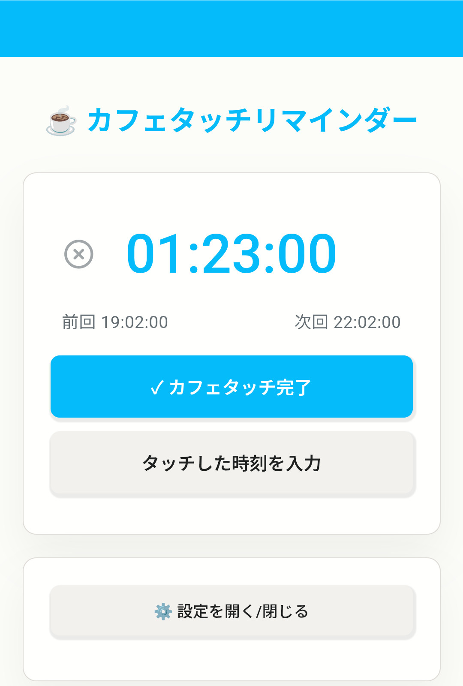

# ☕ カフェタッチリマインダー

スマートフォン向けゲームアプリ『ブルーアーカイブ』内のコンテンツ「カフェ」における、「生徒との交流（タッチ）」のタイミングを管理・通知するためのWebアプリケーション（PWA対応）。

---

## 1. 概要
### 1.1 目的
*   カフェでの「生徒タッチ」による絆ランク（信頼度）上昇の支援。
*   タッチごとの「3時間のクールタイム」および、ゲーム内の「日付変更線（リセット時刻）」を考慮し、タッチ可能なタイミングを逃さず通知する。

---

## 2. 機能一覧
### 2.1 メイン機能
*   **タイマー表示**: 次回タッチまでの時間をリアルタイム表示（タブタイトルにも連動）。
*   **完了ボタン**: 押下時の現在時刻を基準に、次のタイマーをセットする。
*   **遡及入力モード**:
    *   「押し忘れていた」場合のために、過去の時刻を指定して完了登録が可能。
    *   スライダーまたは直接入力で指定。
    *   **制約ロジック**: クールタイム（3時間）または直近の固定リセット時刻の、短い方の範囲内でのみ遡れるよう制限（不正な時刻入力を防止）。

### 2.2 設定・カスタマイズ
*   **時間設定**: クールタイム（分）、操作猶予時間（秒）、固定リセット時刻（複数登録可）。
*   **テーマ**: 
    *   カラー変更（プリセット + 自由選択）。
    *   ダークモード/ライトモード/システム準拠。
*   **通知メッセージ**: リマインド時、完了時のタイトル・本文を自由に編集可能。

---

## 3. 基本ロジック
### 3.1 次回通知時刻の算出ルール
以下の2つの要素を比較し、より早く訪れる時刻を次回の通知タイミングとして設定する。
1.  **クールタイム終了時刻**
    *   前回完了時刻 + 設定されたクールタイム（デフォルト: 180分 = 3時間）
2.  **固定リセット時刻**
    *   設定された固定時刻（デフォルト: 04:00, 16:00）
    *   用途: ゲーム内の日付更新時刻や、カフェ内の生徒更新のタイミングに合わせるために使用。

### 3.2 状態遷移
1.  **カウントダウン**: 次回通知時刻までの残り時間を表示。
2.  **通知発火**: 時刻到来時にブラウザ通知およびアラーム音を実行。
3.  **操作待機 (Action Wait)**:
    *   通知後、「操作にかかる時間（デフォルト: 30秒）」の間、次のタイマーセットを保留する。
    *   理由: 通知を見てすぐにゲームを開き、実際にタッチし終わるまでのタイムラグを考慮するため。
4.  **自動更新**:
    *   操作待機時間が経過すると、自動的に「完了」とみなし、次のサイクルへ移行する（設定でON/OFF可能）。

---

## 4. プラットフォーム別仕様 (ハイブリッド動作)
本アプリは、動作環境に応じて最適な通知挙動を選択するハイブリッド設計を採用しています。

### 4.1 PCブラウザ環境
*   **通知の常駐設定 (requireInteraction)**:
    *   ONにすると、リマインド通知が画面から消えず、クリックするまで残り続ける。
    *   通知をクリックした時の挙動を選択可能：
        *   カフェタッチリマインダーのタブをアクティブにする。
        *   タブをアクティブにせず、「完了」処理のみ行う。
*   **自動更新**: 通知から一定時間後に自動で次の予定を組む機能が利用可能。
*   **スリープ防止**: Web Workerを使用し、バックグラウンドタブでもタイマー精度を維持。

### 4.2 モバイル環境 (Android / iOS)
PWA（ホーム画面に追加）としての利用を推奨。
*   **Web Push API によるバックグラウンド通知**: ブラウザを閉じていても、Cloudflare Workers と連携して正確な時刻にプッシュ通知を配信。
*   **OS設定への最適化**: モバイルOS側の通知設定（ポップアップ、バイブレーション）が優先される仕様に合わせ、アプリ内設定を排してOS設定への誘導ガイドを搭載。
*   **省電力対応**: 端末のスリープ（Doze）モード等による遅延を考慮した、Worker 側での自律的なスケジュール管理。

---

## 5. 技術仕様
*   **フロントエンド**: HTML5 / CSS3 (Vanilla) / JavaScript (Vanilla)
    *   外部ライブラリに依存しない軽量・高速な非同期処理。
*   **バックエンド (Serverless)**: Cloudflare Workers
    *   **Web Push**: VAPID 認証によるセキュアなプッシュ配信。
    *   **Queue / KV**: スケジュール管理および通知のキャンセル状態の同期。
*   **ストレージ**: 
    *   **localStorage**: ユーザー設定の保存。
    *   **Cloudflare KV**: バックグラウンドでの通知ステート維持。
*   **PWA**: Web App Manifest / Service Worker 対応。
